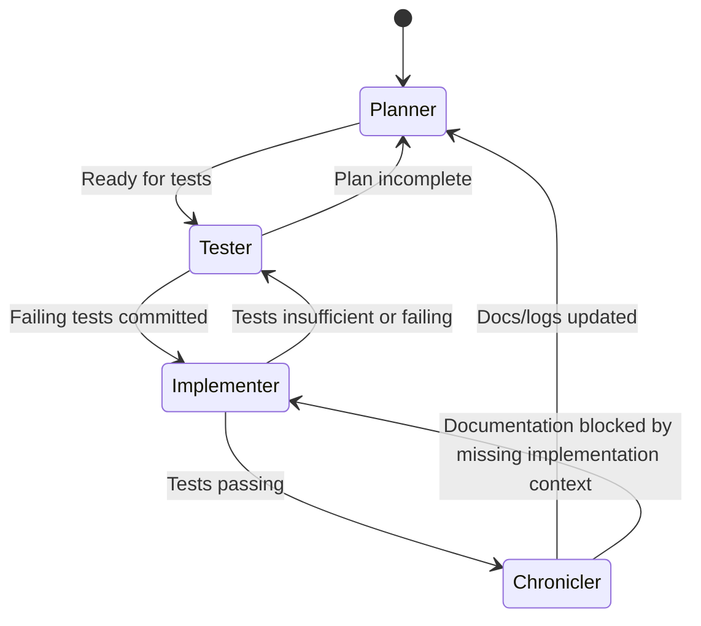

# Handoff Protocols (BLEER)

## Start Here — Single-File Entry

1. If you are a human or cloud agent booting up, simply read this file first. No other
   instruction is required.
2. Follow the **BLEER Quickstart** below verbatim; it will cascade into every other
   artifact that you must inspect.
3. Only leave this file once you know which persona to assume and which supporting files
   you must open next.

Crew Comms coordinates work through an explicit persona state machine. Every agent session must pick
its persona, perform that role exclusively, and then execute a finishing ritual that passes the torch
to the next persona. The goal is to avoid ambiguity and keep the four-agent rotation reliable even
when humans are away from the keyboard for long stretches.

### BLEER Quickstart

1. **Brief** — Jump to the [BLEER Finishing Protocol](#the-bleer-finishing-protocol-recommended)
   section in this file and run Step 1. This will direct you to the most recent
   timestamped session log.
2. **Locate** — The session log you just opened names the persona you must adopt next.
   Open the matching `.context/personas/<persona>.md` playbook.
3. **Evaluate / Execute / Relay** — Continue following the steps in the BLEER protocol.
   They will tell you which additional files (PLAN, FEEDBACK, etc.) to reference and how to
   document your own handoff at the end of the session.

This Start Here section makes `.context/HANDOFF.md` the canonical entrypoint. No
separate `ENTRYPOINT.md` is necessary; agents who open this file receive the complete
instructions to bootstrap themselves.

## The BLEER Finishing Protocol (Recommended)

**BLEER** = **B**rief → **L**ocate → **E**valuate → **E**scalate/Execute → **R**elay.

This protocol defines both how to *start* a session (by locating context) and how to *finish* it
(by relaying the next persona).

### 1. Brief
- Read the latest session entry to understand current scope, blockers, and outstanding TODOs.
- Cross-check PLAN.md, FEEDBACK.md, and relevant persona playbook for role-specific reminders.

### 2. Locate
- Determine the current persona by reading the highest timestamp file in
  `.context/session_logs/`. Each filename encodes the persona at the time it was written
  (`YYYYMMDDThhmmssZ_session-XXX_role.md`).
- Adopt the persona documented inside `.context/personas/<persona>.md` that matches the rotation.

### 3. Evaluate
- Confirm whether the persona you adopted can progress the scope without violating the
  four-agent cycle. Use the state machine diagram below as the source of truth.
- If prerequisites are missing (e.g., Tester finds gaps in the plan), create notes and determine
  whether a reverse handoff is required.

### 4. Escalate / Execute
- Perform only the responsibilities authorised for the persona.
- If work cannot proceed, document why and signal the required persona to revisit the scope.

### 5. Relay
- Create a new session log file documenting what happened, who should act next, and any
  constraints or checklists they must follow.
- Update `SESSION_LOG.md` to append the new entry to the Active Sessions table.
- In your PR description, clearly state the persona used and the next persona expected.

## State Machine (Rotation + Reverse Handoff)

## Alternative Coordination Mechanisms

While BLEER with session-log discovery is the recommended default, teams may temporarily adopt
other mechanisms for experimental or emergency workflows. Document any deviation inside the session
log entry that activates it.

### Option A — Session Log Sentinel (Default)
1. Always adopt the persona recorded in the latest session log file.
2. Maintain rotation by following the mermaid state machine above.
3. Reverse handoffs are expressed by creating a new session log entry that names the persona who
   must act next and the reason for the bounce-back.

### Option B — Torch File Overlay
- Maintain a single JSON or Markdown torch file (e.g., `.context/torch.md`) that explicitly names
  the current persona, scope, and blocker.
- Each agent updates both the torch file *and* the session log when handing off.
- Useful when multiple features run in parallel or when non-linear rotation is unavoidable.

### Option C — Rotation Kanban Board
- Use a lightweight kanban (e.g., `.context/rotation_board.md`) with four columns: Planner, Tester,
  Implementer, Chronicler.
- Cards (features) move clockwise; blocked cards are annotated with the persona required.
- Suitable when batching multiple increments but requires more maintenance discipline.

## Selecting a Protocol
- Default to Option A unless there is a compelling reason to introduce additional artifacts.
- If adopting Option B or C, record the decision and sunset criteria inside the session log and
  FEEDBACK.md so future agents know when to revert to the default.

## Reverse Handoff Expectations
- The agent issuing a reverse handoff must document the exact gap (e.g., "Acceptance criteria
  unclear for /who command"), the persona requested, and any supporting context.
- The receiving persona should reference the same session log entry before acting to confirm the
  rationale and avoid repeating work.

## Persona Adoption Checklist
1. Run the BLEER Brief step and note any dormancy concerns.
2. Locate the persona using the latest session log file and cross-check with the rotation state
   machine.
3. Review `.context/personas/<persona>.md` before executing tasks.
4. Execute responsibilities, update artifacts, and log the session per the Relay step.
5. Explicitly state in the PR (and session log) who should act next.
